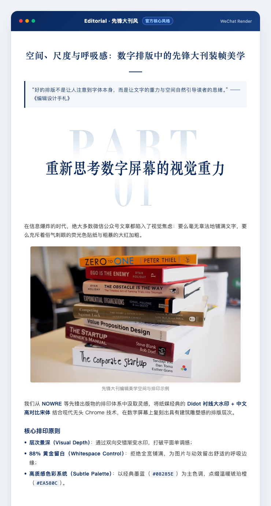

# 🏛️ SQSL WeChat Skill (WeChat Official Account Creator Suite)

<p align="center">
  <strong>An all-in-one Agent Skill Suite for WeChat Official Account creators: from Reverse-Engineering & Style Cloning to Editorial Typesetting and 1-Click Official Draft Push.</strong>
</p>

<p align="center">
  
  
  
  <a href="LICENSE"></a>
</p>

[简体中文](README.md) | English

---

## 🌟 Matrix Highlights

1. **🎬 `sqsl-video-to-article` (Video-to-Article Engine)**: Locally transcribes video with Whisper, automatically post-processes terminology with a custom glossary, extracts precise frames via subtitle timestamps, and crafts authentic, first-person Markdown article drafts.
2. **🎨 `sqsl-style-cloner` (Style Cloner Workshop)**: Reverse-engineers the visual DNA of any WeChat article URL (extracting stylized number images `01/02`, highlight tape background colors, soft paper cards, line spacing) and compiles into a plug-and-play Python style class.
3. **📰 `sqsl-article-to-wechat` (Typesetter & Draft Publisher)**: Turns any Markdown file into high-aesthetic WeChat HTML, auto-extracts the first image as 900x383 header cover, uploads images to WeChat CDN, and pushes directly to your Official Account Draft Box.
4. **🧭 `sqsl-wechat-start` (Master Router)**: A unified entry point (`/sqsl-wechat-start` or shorthand `/sqsl`) that automatically identifies user intent and routes between video transcription, publishing, cloning, and setup guides.

---

## 🎨 Built-in Style Gallery

SQSL comes with publication-grade editorial styling presets. All styles are rendered with WeChat-compatible inline styles and Retina-level visual asset engines, guaranteeing zero style leaks or formatting loss:

| Style Name | Flag | Visual DNA & Aesthetics | Palette | Best Suited For |
| :--- | :--- | :--- | :--- | :--- |
| **Editorial**<br>*(Default Core)* | `--style editorial` | Didot graphic watermark (`PART 01`), high-contrast Songti Chinese serif typography, 88% whitespace media containers | `#08285E`<br>`#EA580C` | In-depth essays, editorial thought pieces, tech & culture journals |
| **Olive Artisan**<br>*(Lifestyle Magazine)* | `--style olive_artisan` | Bodoni bold italic graphic numerals (`01`/`02`), highlighter tape titles, warm oat-grey soft cards, 1.8 relaxed line-height | `#2B2F23`<br>`#E0DEA8` | Interviews, artisan profiles, outdoor, travel, life reflections |

<br/>

<div align="center">

### 1. 🏛️ `editorial` · Editorial (Default Core)
<p align="center"><em>Didot watermark · High-contrast Songti Chinese serif · 88% whitespace media container · Midnight ink blue</em></p>



<br/><br/>

### 2. 🌿 `olive_artisan` · Olive Artisan
<p align="center"><em>Bodoni italic graphic numerals (01/02) · Olive highlighter tape titles · Warm oat cards · 1.8 relaxed line height</em></p>


</div>

---

## ⚡ 1-Click Installation

Compatible with Claude Code, Codex, Antigravity, and any Agent supporting skills standards:

```bash
# Install the entire suite with all sub-skills
npx -y skills add sanqiushili/sqsl-wechat-skill -g --all

# Or install only the typesetter
npx -y skills add sanqiushili/sqsl-wechat-skill/skills/sqsl-article-to-wechat -g
```

---

## 🙏 Acknowledgements & Inspirations

The architectural design and aesthetic foundation of this project are deeply inspired by the following open-source creators:

* **[dontbesilent2025/dbskill](https://github.com/dontbesilent2025/dbskill)**:
  Special thanks to the dbs team for pioneering Agent skill engineering! SQSL Skills adopts dbskill's **Monorepo suite layout**, **`/sqsl` pre-task routing & post-task navigation pattern**, and multi-agent **`AGENTS.md` workbench specifications**.
* **[Guizang (归藏)](https://github.com/op7418)**:
  Heartfelt thanks to Guizang for exceptional contributions to WeChat Official Account visual narrative, social card design systems, and Swiss editorial aesthetics.

### 🎨 Built-in Style Origins
1. **`editorial` (Editorial)**: Reverse-engineered from *ELLE*'s feature *[Handing "Blue" to JISOO, How Would She Style It?](https://mp.weixin.qq.com/s/63NfcghNomURBgBxyjIxGw)*, recreating the signature Didot / Songti dual-gradient watermark typography (`PART 01`/`02`), 88% whitespace media containers, and midnight navy aesthetics.
2. **`olive_artisan` (Olive Artisan)**: Reverse-engineered from *Voicer* magazine's acclaimed feature *[Revisiting Ayu: A Hat Maker and the Free Spirit in the Hills](https://mp.weixin.qq.com/s/2a85ue2uWT9JJpIcTqYYvA)*, recreating the signature Bodoni/Didot graphic numeral headers (`01`/`02`), olive-khaki highlighter tape titles (`#E0DEA8`), warm oat-beige card surfaces (`#F7F6F3`), and 1.8 relaxed line-height.

> ⚠️ **Copyright & Takedown Notice**:  
> The built-in and cloned styling presets in this repository are intended exclusively for personal learning, aesthetic design research, and non-commercial open-source exchange. All intellectual property rights belong to the original creators and respective publications.  
> **If you are a copyright owner or publisher and feel that any preset or asset is inappropriate or infringes on your rights, please reach out via GitHub Issues, and we will promptly review and take down/remove the relevant styles immediately. Thank you for your support and understanding!**

---

## 📄 License & Commercial Customization

This project adopts a **Dual-License Model (Free for Typesetting & Publishing / Commercial Product Integration & Customization)**:

### 1. ✍️ Free for Article Typesetting & Publishing
- **100% Free**: Whether you are an individual creator, blogger, academic, or enterprise/institution, you can freely use this tool for daily WeChat article typesetting, style rendering, and draft pushing without any charge.

### 2. 🏢 Commercial Definition & Style Copyright Disclaimer
- **Engine & Pipeline Integration**: Packaging or integrating the typesetting engine, parsing scripts, or skill suite into commercial SaaS platforms, commercial APPs, paid mini-programs, or commercial tools requires a formal commercial license from the author;
- **⚠️ Style Copyright Disclaimer for Commercial Integration**: The built-in reference styles (such as `editorial` and `olive_artisan` inspired by external editorial features) are strictly intended for open-source research and non-commercial community typesetting. **They are NOT licensed for commercial bundling or resale under any circumstances.** Commercial products requiring visual themes must commission newly bespoke designed styles for the commercial entity to guarantee zero IP and copyright infringement risks.

### 3. 🎨 Bespoke Brand Customization & Services
For brands and organizations requiring tailored visual design and pipeline engineering:
- 🎨 **Brand Visual Design**: Custom-designed brand color palettes and typography systems;
- 🛠️ **Exclusive Layout Components**: Custom data tables, interactive SVG cards, branded watermarks;
- 🚀 **Automated Pipeline Integration**: Seamless automated publishing from Feishu, Notion, Yuque, or GitHub directly to WeChat Draft Box.

> 🤝 **Commercial Licensing & Customization Inquiries**: Contact author via email **[leeguiyu@qq.com](mailto:leeguiyu@qq.com)** or open an issue on [GitHub Issues](https://github.com/sanqiushili/sqsl-wechat-skill/issues). See [LICENSE](LICENSE) for full legal terms.
