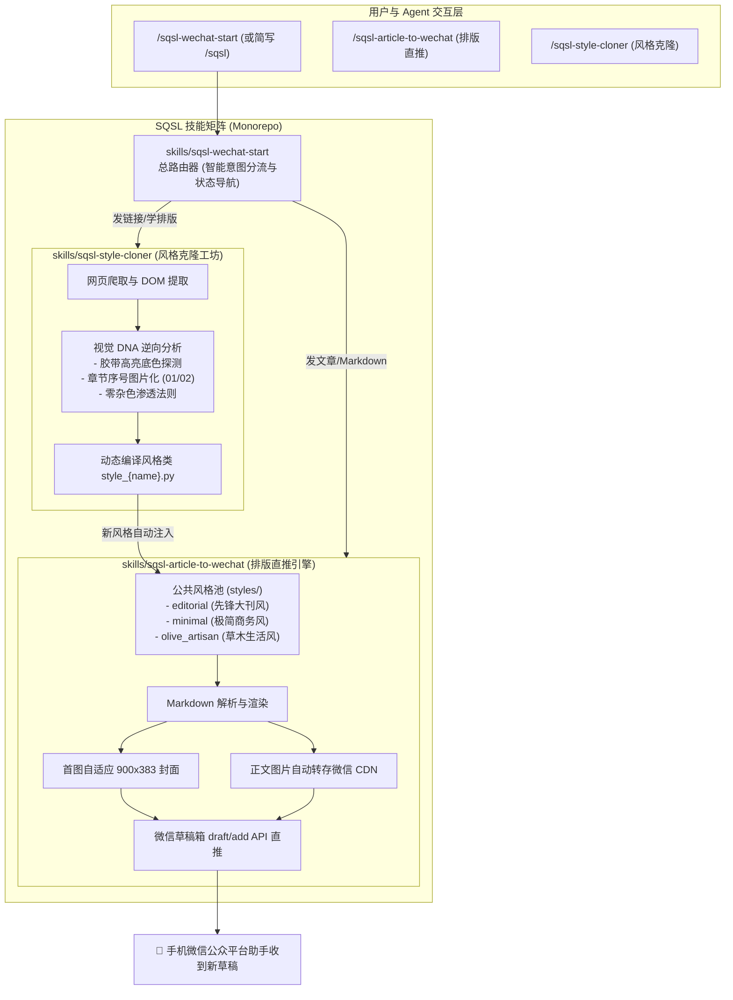

# 🏛️ SQSL WeChat Skill (三秋十李 · 微信公众号创作全家桶)

<p align="center">
  <strong>专为微信公众号创作者打造的一站式 Agent 技能矩阵：从「大号风格逆向复刻」到「杂志大刊排版」再到「官方草稿箱直推」</strong>
</p>

<p align="center">
  <a href="VERSION"></a>
  
  
  
  <a href="LICENSE"></a>
</p>

<p align="center">
  简体中文 | <a href="README.en.md">English</a>
</p>

---

## 🌟 为什么选择 SQSL WeChat Skill 全家桶？

传统的微信公众号排版工具（微信自带编辑器、第三方排版网站）操作繁琐、格式经常错乱、难以批量自动化。

**SQSL WeChat Skill** 将微信内容生产全流程拆解为标准化、可插拔的 Agent 技能矩阵：
1. **🎨 风格克隆工坊 (`sqsl-style-cloner`)**：只要你看到别人家公众号排版好看，发来链接，自动逆向解析其视觉 DNA（大标题艺术数字图片、胶带高亮底色、燕麦米灰卡片、字距呼吸感），生成可插拔风格；
2. **📰 排版直推引擎 (`sqsl-article-to-wechat`)**：Markdown 文档一键渲染为高颜值内联 HTML，自动提取正文首图为 900×383 头条封面，插图自动转存微信官方 CDN，接口直推后台草稿箱，手机端一键审核群发；
3. **🧭 智能总调度路由 (`sqsl-wechat-start`)**：类似 `/dbs`，一个统一入口（`/sqsl-wechat-start` 或简写 `/sqsl`），发文章自动排版，发链接自动克隆，说引导自动导航！

---

## 🏗️ 架构全景与工作流



---

## 📦 目录结构 (Monorepo)

```text
sqsl-wechat-skill/                            # GitHub 唯一根仓库
├── README.md                                 # 中文主说明文档
├── README.en.md                              # 英文主说明文档
├── VERSION                                   # 全局语义化版本号 (1.0.0)
├── CHANGELOG.md                              # 版本更新记录
├── LICENSE                                   # MIT 许可证
├── .gitignore                                # 统一过滤规则（保护凭证）
├── AGENTS.md                                 # Multi-Agent 工作台规范
├── wechat_config.template.json               # 微信公众平台凭证模板
│
└── skills/                                   # 核心子技能目录
    ├── sqsl-wechat-start/                    # 1. 家族总路由主技能 (/sqsl-wechat-start 或 /sqsl)
    │   └── SKILL.md
    │
    ├── sqsl-article-to-wechat/               # 2. 排版与微信草稿直推引擎
    │   ├── SKILL.md
    │   ├── scripts/
    │   │   ├── render_wechat_html.py         # 多风格 Markdown 渲染器
    │   │   └── wechat_draft_publisher.py     # 首图封面提取、CDN转存与草稿直推
    │   ├── styles/                           # 动态热加载风格池
    │   │   ├── style_editorial.py            # SQSL Editorial 杂志大刊风
    │   │   ├── style_minimal.py              # 极简现代商务风
    │   │   └── style_olive_artisan.py        # 阿芋·草木山野生活大刊风
    │   ├── templates/
    │   ├── references/
    │   │   ├── editorial_inspiration.md      # 大刊排版美学灵感
    │   │   └── wechat_setup_guide.md         # 微信公众号 API 详细配置手册
    │   └── examples/
    │       └── sample_editorial_article.md   # 排版测试样例文章
    │
    └── sqsl-style-cloner/                    # 3. 风格逆向与克隆工坊
        ├── SKILL.md
        ├── scripts/
        │   └── clone_wechat_style.py         # 视觉 DNA 逆向提取与风格代码生成
        ├── templates/
        │   └── style_template.py             # 风格类代码模板
        └── examples/
            └── sample_wechat_article.html    # 离线测试样例
```

---

## ⚡ 极速上手

### 1. 一键安装（推荐：通过 `skills` 包管理器）

支持 Claude Code、Codex、Antigravity 等所有兼容 Agent Skills 规范的环境：

```bash
# 一键安装全家桶（包含总路由、排版发布、风格克隆）
npx -y skills add <你的GitHub用户名>/sqsl-wechat-skill -g --all

# 或按需单装其中一个子技能
npx -y skills add <你的GitHub用户名>/sqsl-wechat-skill/skills/sqsl-article-to-wechat -g
```

### 2. 配置微信公众平台凭证 (可选，免配置也能一键复制)

若需要使用官方 API 一键直推草稿箱：
1. **访问微信开发者平台**：[https://developers.weixin.qq.com/](https://developers.weixin.qq.com/) 登录；
2. **定位公众号**：在首页下方 **「我的业务」** 找到对应公众号 ➔ **「基础能力」➔「开发秘钥」** 获取 `AppID` 并生成保存 `AppSecret`；
3. **配置 IP 白名单**：同区域将本机公网 IP（终端运行 `curl cip.cc`）加入白名单；
4. **本地配置**：复制模板创建 `wechat_config.json`：
   ```bash
   cp wechat_config.template.json wechat_config.json
   ```
   填入你的 `app_id` 与 `app_secret`。*(也可通过环境变量 `export WECHAT_APPID="xxx"` 提供)*

> 💡 **不想配置 API？立刻就能用！** 系统每次排版都会生成本地 `_预览.html`，浏览器打开点顶部的「一键复制到公众号」即可无损粘贴！

---

## 💬 对话使用示例

直接在支持 Agent 的聊天框中输入：

* **总路由智能调度**：
  ```text
  /sqsl-wechat-start 帮我排版这篇文稿并推送到公众号：docs/post.md
  ```
  ```text
  /sqsl-wechat-start 帮我把这篇公众号的排版风格克隆下来：https://mp.weixin.qq.com/s/xxxxxxxxxxxx
  ```
  *(注：主技能支持简写命令 `/sqsl` 或 `/sqsl-start`)*
* **排版并直推草稿箱**：
  ```text
  /sqsl-article-to-wechat 用 olive_artisan 风格排版 docs/post.md
  ```
* **风格逆向克隆**：
  ```text
  /sqsl-style-cloner https://mp.weixin.qq.com/s/xxxxxxxxxxxx --name cool_lifestyle
  ```

---

## 🙏 致谢与灵感之源 (Acknowledgements & Inspirations)

本项目的架构设计与排版美学深受开源社区与先锋创作者的启发，特别致敬与感谢：

* **[dontbesilent2025/dbskill](https://github.com/dontbesilent2025/dbskill)**：
  感谢 dbs 团队在 Agent 技能工程化上的开拓性实践！本项目在 **Monorepo 全家桶矩阵架构**、**`/sqsl` 任务前路由与任务后导航模式** 以及多端 **`AGENTS.md` 工作台规范** 上均深度借鉴了 dbskill 的优秀架构思想。
* **[归藏 (Guizang)](https://github.com/op7418)**：
  感谢归藏在微信公众号视觉叙事、社交图文卡片排版美学上的持续输出与设计启发，为本项目奠定了追求“大刊呼吸感、克制版式与高级质感”的美学标准。

### 🎨 内置核心风格的灵感溯源

1. **`editorial`（SQSL 先锋大刊风）**：
   - 汲取自 *Nowre*、*GQ* 等潮流大刊，采用 Didot / 宋体水印标题图层、88% 留白图片容器与深邃墨蓝先锋质感；
2. **`olive_artisan`（阿芋 · 草木山野生活大刊风）**：
   - 逆向解构自 *Voicer* 杂志深度专访名篇[《重访阿芋：是制帽师，也是山野里的自在风》](https://mp.weixin.qq.com/s/2a85ue2uWT9JJpIcTqYYvA)，1:1 像素级还原了标志性的 Bodoni/Didot 粗斜体艺术大数字插图图层（`01`/`02`）、黄绿胶带高亮居中大标题（`#E0DEA8`）、温润燕麦米灰软卡片（`#F7F6F3`）以及极为松弛的 1.8 舒适行高与 1.5px 呼吸字距。

> ⚠️ **版权与免责声明**：  
> 本项目内置及逆向复刻的排版样式仅供个人学习、排版审美交流与开源技术研究使用，相关视觉元素与版面设计的知识产权均归原作者/出品机构所有。  
> **若原作者或相关权利方认为某些元素的使用存在不妥或涉及侵权，请随时通过 Issue 或邮件联系我们，我们将在第一时间予以核实并立即下架/移除对应样式，感谢理解与包容！**

---

## 📄 开源许可证

本项目基于 [MIT License](LICENSE) 开源。欢迎 Star、Fork 与贡献你的精彩排版风格！
