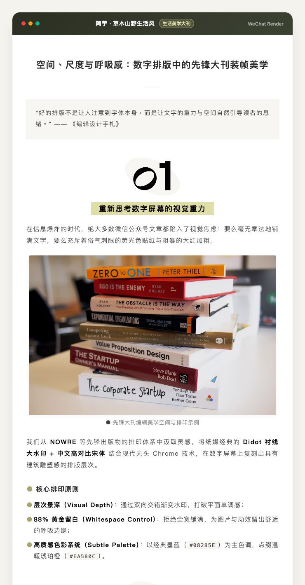
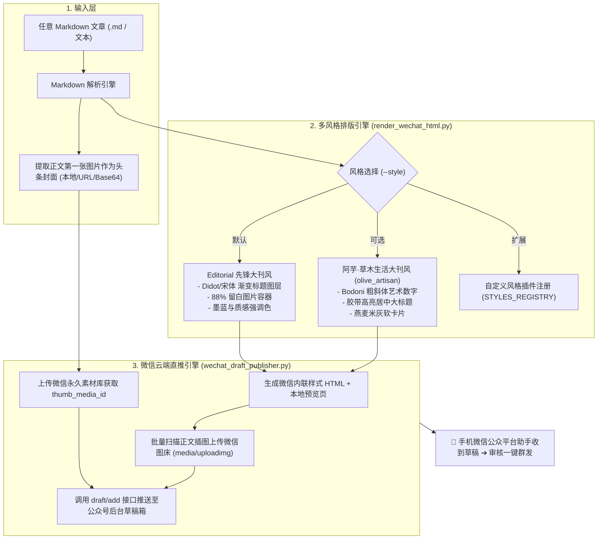

# 📰 SQSL Article to WeChat

<p align="center">
  <strong>杂志大刊级微信公众号自动化排版与草稿箱云端直推系统</strong>
</p>

<p align="center">
  <a href="VERSION"></a>
  
  
  
  <a href="LICENSE"></a>
</p>

<p align="center">
  简体中文 | <a href="README.en.md">English</a>
</p>

<p align="center">
  <a href="#-一键安装与更新">一键安装</a> · <a href="#-快速上手">快速上手</a> · <a href="#-核心特性">核心特性</a> · <a href="#-视觉灵感与装帧美学-aesthetic-heritage">视觉美学</a> · <a href="CHANGELOG.md">更新日志</a>
</p>

---

## ⚡ 一键安装与更新

### 1. 推荐：通过 `skills` 包管理器一键安装（Claude Code、Codex、Antigravity、WorkBuddy 等）

在终端直接执行：

```bash
npx -y skills add sanqiushili/sqsl-wechat-skill/skills/sqsl-article-to-wechat -g
```

安装后回到 Agent，输入 `/sqsl-article-to-wechat` 即可使用。

### 2. Git 源码克隆安装

```bash
git clone https://github.com/sanqiushili/sqsl-wechat-skill.git
```

### 4. 版本更新

当仓库发布新版本时，直接在终端执行：

```bash
npx -y skills update sqsl-article-to-wechat
```
或者在对应技能目录中运行 `git pull`，即可无缝同步最新版本，不会覆盖你的 `wechat_config.json` 个人凭证。

---

## 🌟 为什么需要 SQSL Article to WeChat？

传统的微信公众号排版工具往往存在几个痛点：
1. **格式脆弱易丢失**：从第三方编辑器复制后，微信后台经常过滤 class、CSS 变量与外部样式，导致排版变形；
2. **割裂的发布流程**：排完版需人工在后台建草稿、手动切图 900×383 封面、手动上传多张正文图片；
3. **视觉千篇一律**：充斥着俗气的荧光色框与低质花哨贴纸，缺乏真正的阅读质感与呼吸感。

**SQSL Article to WeChat** 提供了一条**全自动端到端的内容发布流水线**：
从本地任意 Markdown 稿件出发，一键完成 **「先锋大刊视觉排版 ➔ 正文首图自动提取为头条封面 ➔ 微信官方图床批量转存 ➔ 微信公众平台草稿箱一键直推」**。

---

## 🎨 视觉灵感与装帧美学 (Aesthetic Heritage)

本项目的核心风格 **`Editorial（先锋大刊风）`** 逆向解构自 **ELLE** 时尚大刊名篇[《把“蓝色”交给 JISOO，她会怎么穿？》](https://mp.weixin.qq.com/s/63NfcghNomURBgBxyjIxGw)的高级装帧体例：

* **Didot 衬线大水印 + 中文高对比宋体**：上层 `PART` 渐变下沉，下层数字 `01/02` 渐变上抬，与居中的高对比宋体主标题纵深交织；
* **Retina 级免过滤图层渲染**：系统在后台调用无头 Chrome，将渐变交织的水印标题自动渲染为高精度透明图层嵌入 HTML，100% 免疫微信编辑器的样式清洗；
* **88% 黄金呼吸留白**：正文插图与动效拒绝粗暴的全宽拉伸，统一采用 88% 优雅居中留白搭配轻微投影（`box-shadow: 0 2px 10px rgba(0,0,0,0.05)`）；
* **克制的高级色彩系统**：以经典墨蓝（`#08285E`）为主色调，点缀温暖琥珀橙（`#EA580C`），营造沉稳、深邃、典雅的阅读体验。

> 📖 详见设计美学白皮书：[references/editorial_inspiration.md](references/editorial_inspiration.md)

### 📸 内置排版风格样例预览

<div align="center">

| 🏛️ `editorial` (先锋大刊风) | 🌿 `olive_artisan` (草木生活大刊风) |
| :---: | :---: |
|  |  |
| **Didot 水印 · 宋体中文 · 墨蓝先锋** | **Bodoni 艺术数字 · 胶带高亮 · 燕麦卡片** |

</div>

---

## 🚀 核心特性

| 特性 | 传统排版流程 | SQSL Article to WeChat |
| :--- | :--- | :--- |
| **排版风格** | 纯静态模板或单一组件 | **多风格可插拔架构**（内置先锋大刊风 `editorial` 与草木生活大刊风 `olive_artisan`） |
| **头条封面** | 需人工切图 900×383 并手动上传 | **自动识别正文首图** 裁剪上传素材库（支持本地图/网络图/Base64/文字兜底） |
| **图床管理** | 需在后台手动逐张上传图片 | **全自动上传微信 CDN (`media/uploadimg`)** 并替换为 `mmbiz.qpic.cn` 链接 |
| **发布推送** | 需手动在网页端全选复制粘贴 | **调用微信官方 API (`draft/add`) 一键直推草稿箱**，手机即可一键群发 |
| **预览体验** | 依靠在线编辑器 | **生成带磨砂悬浮复制栏的本地 HTML 预览页**，双保险兜底 |

---

## 🛠️ 流水线架构



---

## 📦 目录结构

```text
sqsl-article-to-wechat/
├── README.md                          # 项目说明文档（中文）
├── README.en.md                       # 项目说明文档（English）
├── VERSION                            # 语义化版本号文件 (v1.0.0)
├── CHANGELOG.md                       # 详细版本迭代记录
├── LICENSE                            # 双重授权开源许可证
├── SKILL.md                           # AI Agent 技能配置说明书
├── wechat_config.template.json        # 微信凭证配置模板
├── .gitignore                         # Git 忽略配置（防止凭证泄露）
├── assets/                            # 设计素材与图标
├── references/
│   └── editorial_inspiration.md       # 大刊风设计灵感与排版法则
├── examples/
│   └── sample_editorial_article.md    # 完整排版测试样例文章
├── templates/
│   └── cover_fallback.html            # 无图文章兜底封面模板
└── scripts/
    ├── render_wechat_html.py          # 多风格 Markdown 渲染排版引擎
    └── wechat_draft_publisher.py      # 首图封面提取、图床转存与草稿箱直推
```

---

## ⚡ 快速上手

### 1. 环境准备
确保已安装 Python 3.9+ 及 Google Chrome（用于无头渲染高精度大刊标题图层）：
```bash
python3 --version
# Chrome 默认路径: /Applications/Google Chrome.app (macOS)
```

### 2. 配置微信公众平台凭证 (AppID & AppSecret)

获取微信公众号官方 API 凭证的步骤：

1. **登录微信开发者平台**：访问 [https://developers.weixin.qq.com/](https://developers.weixin.qq.com/) 扫码登录；
2. **定位你的公众号业务**：在首页下方找到 **「我的业务」**，点击列表中你管理的公众号；
3. **获取开发秘钥**：进入后在 **「基础能力」** 栏目下找到 **「开发秘钥」**，获取你的 `AppID` 并生成保存 `AppSecret`；
4. **配置 IP 白名单**：在同一区域找到 **「IP 白名单」**，将运行本工具的本机公网 IP 添加进白名单（终端运行 `curl cip.cc` 可查公网 IP）；
5. **本地配置凭证**：复制模板文件并填入凭证：
   ```bash
   cp wechat_config.template.json wechat_config.json
   ```
   编辑 `wechat_config.json`：
   ```json
   {
     "app_id": "你的微信公众号AppID",
     "app_secret": "你的微信公众号AppSecret"
   }
   ```
   *也可以直接通过环境变量提供：`export WECHAT_APPID="xxx"` 与 `export WECHAT_APPSECRET="xxx"`。*

> **💡 完整图文引导**：详见 [微信公众平台 API 详细配置指南](references/wechat_setup_guide.md)。

---

## 💻 命令行使用

### (1) 仅生成排版 HTML 与本地预览页
```bash
python3 scripts/render_wechat_html.py "examples/sample_editorial_article.md" --style editorial
```
* 产出：
  - `sample_editorial_article_微信排版.html`（内联样式纯净 HTML）；
  - `sample_editorial_article_预览.html`（在浏览器打开，可点击悬浮栏「一键复制到公众号」）。

### (2) 一键直推微信公众平台草稿箱
```bash
python3 scripts/wechat_draft_publisher.py "sample_editorial_article_微信排版.html" --title "空间、尺度与呼吸感：数字排版中的先锋大刊装帧美学"
```
*可选参数*：
- `--cover "/path/to/cover.png"`：手动指定封面图（若未提供，将自动提取文章中的第一张图片）；
- `--author "作者名"`：设置微信公众号显示的作者名；
- `--digest "摘要"`：自定义文末或推送摘要（默认提取标题）。

---

## 🤖 作为 Agent 技能使用 (Claude Code / Codex / Antigravity)

在对话中直接触发：
```text
/sqsl-article-to-wechat 帮我把这篇 Markdown 文章排版并推送到公众号草稿箱：docs/article.md
```
或
```text
/文章发公众号 用 olive_artisan 风格排版这篇文章并推送到微信后台。
```

---

## 📄 开源许可证与商业定制

本项目采用双重授权模式（文章排版完全免费 / 商业产品集成授权与专属定制）。
如有商业产品集成或品牌定制需求，请联系 **leeguiyu@qq.com**。详见根目录 [LICENSE](../../LICENSE)。
欢迎 Fork、Star 与提交 PR！
