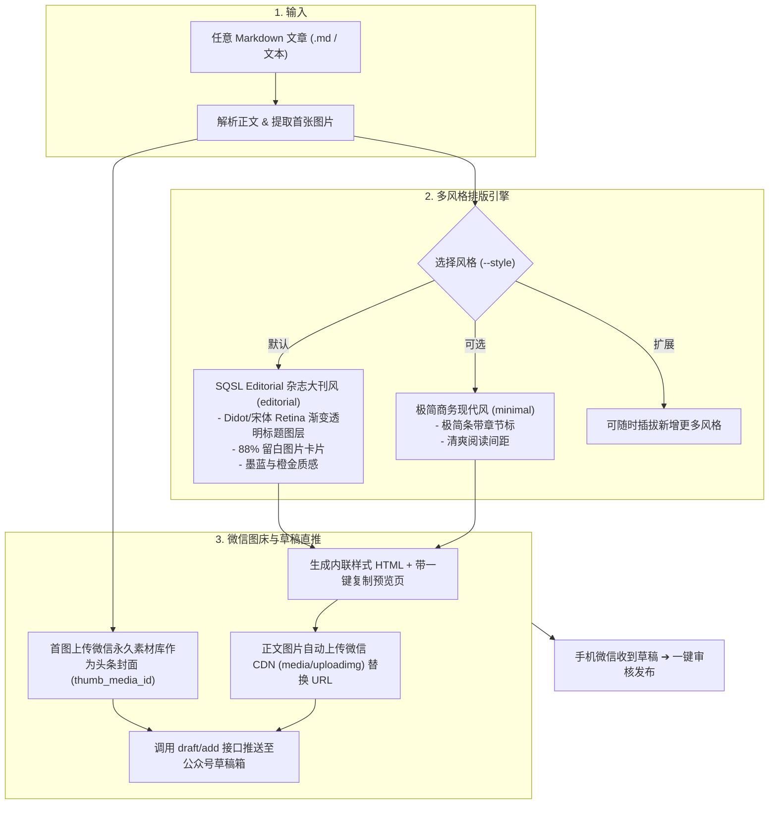

# SQSL Article To WeChat：通用微信公众号排版与草稿箱直推系统

通用的 Markdown 文章排版与微信发布工具，能够将任意 **Markdown 文档 / 本地文稿 / 知识库笔记** 一键转化为 **多风格精美排版、首图自适应封面、直推微信公众平台草稿箱** 的高水准公众号文章。

---

## 核心能力与流水线



---

## 工作模式与快速指令

### 0. 新手引导与配置模式（关键词：使用引导 / 怎么用 / 帮助 / 新手）

> **触发条件**：当用户输入包含 **「使用引导」**、**「怎么用」**、**「新手」**、**「帮助」**、**「API配置」**，或初次唤起且未提供文章时：
> **Agent 行为**：**必须直接输出以下结构化新手引导**，无需索要文章或报错。

**引导输出结构**：
1. **这是什么**：一键将 Markdown 转化为高颜值大刊排版、提取正文首图为头条封面并直推微信公众平台草稿箱；
2. **如何获取微信 API（5 步配置法）**：
   - 访问微信开发者平台：`https://developers.weixin.qq.com/` 扫码登录；
   - 首页下方找到 **「我的业务」** 中的对应公众号；
   - 点击进入 **「基础能力」➔「开发秘钥」**，复制 `AppID` 并生成保存 `AppSecret`；
   - 同区域找到 **「IP 白名单」**，将当前电脑公网 IP（终端运行 `curl cip.cc`）添加进去；
   - 在技能目录下的 `wechat_config.json` 填入 `app_id` 和 `app_secret`。
3. **免 API 纯复制模式（立刻能用）**：
   - 若暂未配置 API，也可以直接发文章给技能，系统会自动生成带「一键复制到公众号」悬浮栏的本地 `_预览.html`，浏览器打开点一下即可无损粘贴进后台；
4. **下一步操作示范**：
   - 给用户 2 个可直接点击/复制发送的体验指令：
     - *“帮我用大刊风排版示例文章：`examples/sample_editorial_article.md`”*
     - *“这是我的文章草稿：[粘贴文字]，帮我排版并推送到草稿箱”*

---

### 1. 默认大刊排版并直推微信草稿箱
直接向 Agent 发送指令或使用快捷命令：
```text
/sqsl-article-to-wechat 帮我把这篇文章排版并推送到公众号：[路径/内容]
```
或
```text
/文章发公众号 把 docs/my_post.md 排版发到微信草稿箱。
```

**Agent 自动执行流程**：
1. 解析 Markdown 内容并提取文章中的**第一张图片**；
2. 运行 `render_wechat_html.py`，采用 **先锋大刊风 (`editorial`)** 渲染内联样式 HTML 与预览文件；
3. 运行 `wechat_draft_publisher.py`：
   - 将提取的**正文首图**自动上传至微信素材库作为 **900×383 头条封面**；
   - 自动上传正文所有插图至微信图床并替换为 `mmbiz.qpic.cn` 链接；
   - 推送至微信公众号草稿箱（输出草稿 Media ID）；
4. 同时输出带「一键复制到公众号」的本地预览 HTML，方便人工预览与手动复制备用。

---

### 2. 指定不同排版风格
可以通过 `--style` 指定排版风格：
* `editorial`（默认）：先锋大刊风（Didot 衬线大水印 + 中文宋体标题图层、88% 留白插图、重点引言卡）；
* `minimal`：极简现代商务风（清爽排版、几何条带章节标、适合技术与干货分享）。

例如：
```text
/sqsl-article-to-wechat 请用极简风格 (minimal) 排版这篇文章：[文章内容]
```

---

### 3. 命令行调用脚本

排版与发布也可以直接在终端通过脚本运行：

#### (1) 仅生成排版 HTML 与预览页
```bash
python3 /Users/liguiyu/.gemini/config/skills/sqsl-article-to-wechat/scripts/render_wechat_html.py "文章路径.md" --style editorial
```
*输出：`文章名_微信排版.html`（内联样式纯净版）和 `文章名_预览.html`（带一键复制按钮的浏览器预览版）。*

#### (2) 直推微信草稿箱（自动提取首图作为封面）
```bash
python3 /Users/liguiyu/.gemini/config/skills/sqsl-article-to-wechat/scripts/wechat_draft_publisher.py "文章名_微信排版.html" --title "文章标题"
```
*可选参数：*
- `--cover "/path/to/custom_cover.png"`：手动指定封面（若不提供则自动提取正文首图）；
- `--author "作者名"`：设置微信公众号显示作者；
- `--digest "摘要"`：自定义文末或推送摘要（默认截取正文/标题）。

---

## 封面图提取规则（First-Image-as-Cover）

1. **第一优先级（显式指定）**：命令行传入 `--cover <图片路径>` 时，优先使用该封面；
2. **第二优先级（正文首图自动提取）**：扫描文章中的第一张图片（支持 Markdown 本地相对路径、绝对路径、网络 URL 图片下载、Base64 图片），上传到微信永久素材库获取 `thumb_media_id`；
3. **第三优先级（兜底封面生成）**：若整篇文章没有插图，系统将自动使用无头 Chrome 渲染一张 900×383 艺术渐变大标题封面图进行兜底上传。

---

## 微信公众平台凭证配置指南

官方 API 凭证获取路径（微信开发者平台）：
1. **登录微信开发者平台**：访问 [https://developers.weixin.qq.com/](https://developers.weixin.qq.com/) 扫码登录；
2. **定位你的公众号**：在首页下方找到 **「我的业务」**，点击列表中你管理的公众号；
3. **获取开发秘钥**：进入公众号管理页，在 **「基础能力」** 栏目下找到 **「开发秘钥」**，获取你的 `AppID` 并生成保存 `AppSecret`；
4. **配置 IP 白名单 (必须)**：在同一区域找到 **「IP 白名单」**，将本机的公网 IP 添加到白名单中（终端运行 `curl cip.cc` 可查公网 IP）；
5. **本地配置文件**：在技能根目录的 `wechat_config.json` 中填入：
   ```json
   {
     "app_id": "你的微信公众号AppID",
     "app_secret": "你的微信公众号AppSecret"
   }
   ```
   也可以通过系统环境变量提供：`WECHAT_APPID` 与 `WECHAT_APPSECRET`。

> **注意事项**：
> 微信公众平台 API 要求调用者的出口公网 IP 在白名单中。若推送时遇 `40164` 报错，请将报错信息中提示的 IP 地址添加到开发者平台【基础能力 ➔ 开发秘钥 ➔ IP白名单】中。
> 详见 [references/wechat_setup_guide.md](references/wechat_setup_guide.md)。
