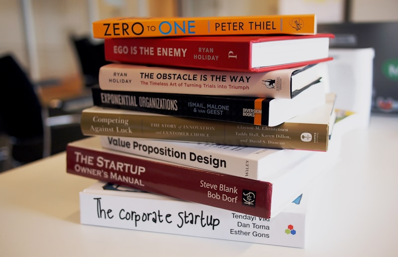

# 空间、尺度与呼吸感：数字排版中的先锋大刊装帧美学

> “好的排版不是让人注意到字体本身，而是让文字的重力与空间自然引导读者的思绪。” —— 《编辑设计手札》

## 重新思考数字屏幕的视觉重力

在信息爆炸的时代，绝大多数微信公众号文章都陷入了视觉焦虑：要么毫无章法地铺满文字，要么充斥着俗气刺眼的荧光色贴纸与粗暴的大红加粗。



我们从 **NOWRE** 等先锋出版物的排印体系中汲取灵感，将纸媒经典的 **Didot 衬线大水印 + 中文高对比宋体** 结合现代无头 Chrome 技术，在数字屏幕上复刻出具有建筑雕塑感的排版层次。

### 核心排印原则

- **层次景深（Visual Depth）**：通过双向交错渐变水印，打破平面单调感；
- **88% 黄金留白（Whitespace Control）**：拒绝全宽铺满，为图片与动效留出舒适的呼吸边缘；
- **高质感色彩系统（Subtle Palette）**：以经典墨蓝（`#08285E`）为主色调，点缀温暖琥珀橙（`#EA580C`）。

## 代码与自动化发布工程

通过将复杂的排版逻辑解耦为模块化 Python 脚本，我们可以实现从 Markdown 到微信草稿箱的一键直推：

```python
from sqsl_engine import render_editorial, push_to_wechat

# 1. 渲染 Retina 级透明水印与内联样式 HTML
html_doc, preview_doc = render_editorial("article.md", style="editorial")

# 2. 自动提取首图作为 900x383 封面并直推草稿箱
draft_id = push_to_wechat(html_doc, title="数字排版中的先锋大刊装帧美学")
print(f"✓ 成功推送到微信后台草稿箱，Media ID: {draft_id}")
```

## 排版系统能力对照表

| 排版能力 | 传统网页排版 | SQSL 自动化排版系统 |
| :--- | :--- | :--- |
| **标题视觉** | 普通 CSS 文本 | Retina 级 Didot/宋体 渐变透明图层 |
| **封面获取** | 需人工切图上传 | 自动提取正文首图并转存素材库 |
| **微信图床** | 需手动逐张上传 | 批量自动转存 `mmbiz.qpic.cn` |
| **发布方式** | 手动全选粘贴 | 官方草稿箱 API 一键直推 + 本地预览 |

---

愿每一个认真写作的人，都能拥有真正匹配其思想高度的排版与呈现。
