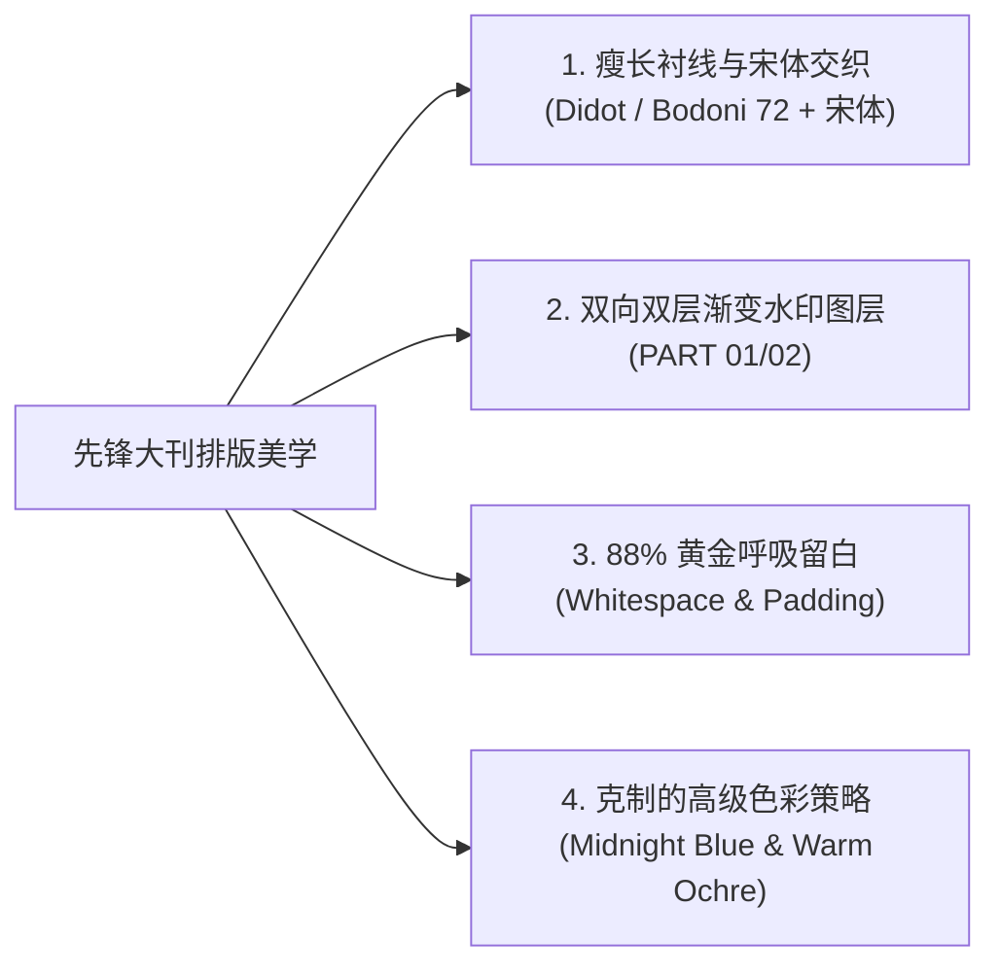

# SQSL Editorial 杂志大刊风 —— 视觉美学与排版灵感来源

## 灵感起源 (Inspiration & Heritage)

**SQSL Editorial（先锋杂志大刊风）** 的排版美学灵感源自国内外顶尖潮流与设计杂志（如 NOWRE、Monocle、Kinfolk、BranD 等先锋出版物）的高级编辑体例。

在传统的公众号文章中，排版往往陷入两个极端：要么是毫无呼吸感的纯文本堆砌，要么是充斥着低质花哨贴纸、荧光色框与粗暴大红加粗的低阶排版。

SQSL Editorial 的初衷是：**将纸媒时代的先锋大刊装帧美学，通过严谨的现代 CSS 架构与动态图形渲染，100% 免疫微信格式清洗，降维移植到数字屏幕上。**

---

## 核心设计法则 (Design Principles)

### 1. 字体层级与排印交织 (Typography Hierarchy)
- **英文水印**：采用古典高雅且极具张力的 **Didot / Bodoni 72** 瘦长高对比衬线体，大幅度拉开字距（`letter-spacing: 24px`），赋予版面深邃的建筑感与仪式感；
- **中文前景**：采用挺拔秀丽的 **高对比宋体 (Songti SC / Noto Serif)**，粗细分明、字形端庄；
- **排印交织**：中文主标居中置于双层半透明英文水印之间（上层 `PART` 下沉，下层数字 `01/02` 上抬），形成经典大刊特有的空间景深感。

### 2. 双向双层渐变水印 (Dual Gradient Watermark)
- 顶部 `PART` 水印采用从浅蓝灰（`#BDCCDC`）向透明（`#FFFFFF 0% opacity`）下行淡出的线性渐变；
- 底部数字水印采用从纯白透明向上行加深的线性渐变；
- 为了确保在微信公众号后台 100% 免过滤、不丢失渐变与字体渲染精度，系统后台调用无头 Chrome 自动化渲染为 Retina 级透明 PNG/SVG 图层嵌入。

### 3. 88% 黄金呼吸留白 (88% Whitespace Rule)
- 拒绝让配图与动效充满屏幕边缘（`width: 100%` 会带来强烈的视觉压迫感与边缘变形）；
- 统一采用 **88% 容器留白比率**（`display: inline-block; width: 88%; border-radius: 4px; box-shadow: 0 2px 10px rgba(0,0,0,0.05);`），让读者在滑动时视觉焦点自然聚拢在内容本身。

### 4. 克制的高级色彩策略 (Subtle Color Palette)
- **主调墨蓝**：`#08285E`（沉稳、深邃、专业）；
- **强调暖橙**：`#EA580C` 与 `#FFF0E6` 浅底（仅在极少数关键亮点与标签处作为点缀，绝不大面积滥用）；
- **中性正文**：`#1C1C1C` 搭配灰调背景 `#F4F7FA` 引言卡片，提供柔和不刺眼的长时间长文阅读体验。
