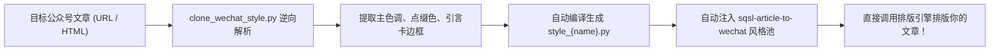

# 🎨 SQSL Style Cloner

<p align="center">
  <strong>微信公众号排版风格逆向解析与克隆工坊</strong>
</p>

<p align="center">
  <a href="VERSION"></a>
  
  
  <a href="LICENSE"></a>
</p>

<p align="center">
  简体中文 | <a href="README.en.md">English</a>
</p>

---

## 🌟 为什么需要 SQSL Style Cloner？

当我们在微信上阅读到某些头部大号的排版时，常被其沉稳的配色、高雅的标题边框和精致的引言卡片打动，但手动在第三方排版软件中一个一个提取颜色、试探字号边距极为耗时费力。

**SQSL Style Cloner** 能够：
1. **一键逆向分析**：直接输入任意微信公众号文章链接（URL）或 HTML 片段，自动解析提取正文 CSS 中的主色、点缀色、引言卡底色、边框样式及字阶；
2. **自动编译风格模块**：将视觉 DNA 自动编译为标准的 Python 风格类；
3. **无缝注入排版引擎**：克隆出的风格自动注入 `sqsl-article-to-wechat/styles/`，排版时输入 `--style <风格名>` 即可直接套用！

---

## 🛠️ 工作流程



---

## ⚡ 一键安装与快速使用

### 1. 通过 `skills` 包管理器安装

```bash
npx -y skills add sanqiushili/sqsl-wechat-skill/skills/sqsl-style-cloner -g
```

### 2. 在 AI Agent 中对话使用

直接在对话框输入公众号链接：
```text
/sqsl-style-cloner https://mp.weixin.qq.com/s/xxxxxxxxxxxx --name tech_blue --display-name "极客深蓝风"
```
或直接用自然语言：
```text
/克隆公众号风格 帮我把这篇公众号文章的样式复刻下来：https://mp.weixin.qq.com/s/xxxxxxxxxxxx
```

### 3. 命令行终端运行

```bash
# 从公众号链接克隆
python3 scripts/clone_wechat_style.py "https://mp.weixin.qq.com/s/xxx" --name "geek_blue" --display-name "极客深蓝风"

# 从本地 HTML 片段克隆
python3 scripts/clone_wechat_style.py "examples/sample_wechat_article.html" --name "emerald_forest" --display-name "翡翠森林风"
```

---

## 🔗 与排版引擎联动

克隆成功后，你可以在 `sqsl-article-to-wechat` 中直接使用这个新风格：

```bash
python3 ../sqsl-article-to-wechat/scripts/render_wechat_html.py "我的文章.md" --style geek_blue
```
或者在 Agent 对话中：
```text
/sqsl-article-to-wechat 用 geek_blue 风格排版我的文章并推送到草稿箱！
```

---

## 📄 开源许可证

MIT License.
