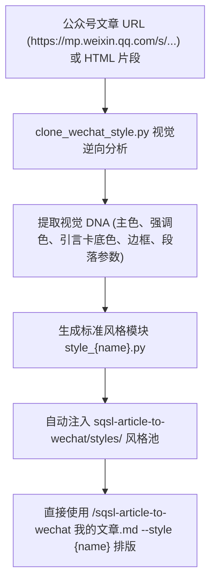
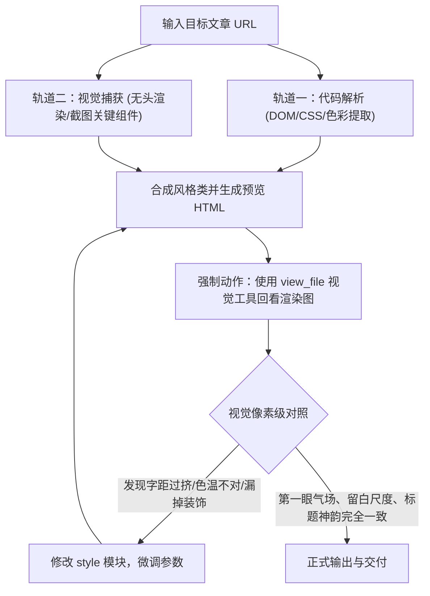

# SQSL Style Cloner：微信公众号排版风格逆向与克隆工坊

专为内容创作者与排版设计师打造的 **公众号排版逆向工程与风格克隆引擎**。能够将任意一篇你喜欢的微信公众号文章的视觉调性（主色调、强调色、引言卡片、标题装饰、列表符号等），**一键逆向提取并无缝注册到 `sqsl-article-to-wechat` 排版引擎中**，让你的文章即刻套用该大号的排版质感！

---

## 核心流程



---

## 工作模式与快速指令

### 0. 新手引导模式（关键词：使用引导 / 怎么用 / 帮助 / 新手）

> **触发条件**：用户输入包含 **「使用引导」**、**「怎么用」**、**「新手」**、**「帮助」** 时：
> **Agent 行为**：**直接输出下方结构化指引**：

**引导内容**：
1. **这是什么**：只要你看到别人家公众号排版好看，把链接发给我，我就能帮你把它的配色与排版风格“复刻克隆”下来；
2. **怎么用**：发送 `/sqsl-style-cloner https://mp.weixin.qq.com/s/...` 或直接发送文章链接并说“克隆这个排版”；
3. **克隆后在哪**：克隆完成后会自动生成一个风格代号（如 `urban_chic`），并自动注册到 `sqsl-article-to-wechat`；
4. **如何使用新风格**：克隆后，在排版文章时直接使用 `--style 你的风格代号` 即可完美调用！

---

### 1. 克隆并提取指定公众号风格

直接向 Agent 发送公众号文章链接：
```text
/sqsl-style-cloner https://mp.weixin.qq.com/s/xxxxxxxxxxxx --name tech_blue --display-name "极客深蓝风"
```
或直接用自然语言：
```text
/克隆公众号风格 帮我把这篇公众号的排版样式提取出来：https://mp.weixin.qq.com/s/xxxxxxxxxxxx
```

**Agent 自动执行流程**：
1. 运行 `clone_wechat_style.py` 抓取并解析文章正文；
2. 提取视觉 DNA 并输出色彩卡与调色板；
3. 编译生成 `style_{name}.py`，自动部署到 `sqsl-article-to-wechat/styles/` 目录；
4. 生成本地 `_风格预览.html` 供用户验收；
5. 提示用户现在可以使用 `/sqsl-article-to-wechat 文档.md --style {name}` 直接排版。

---

## 🎯 逆向克隆核心军规（四大复盘教训与六大必查约束）

在进行排版风格复刻时，必须严格遵守以下军规，**绝不能只抓几个颜色就草率套模版**：

### 1. 四大历史教训与防范机制

1. **拒绝死板的全局色彩计数（色彩深度解构）**：
   - *教训*：单纯用 `Counter()` 统计所有 CSS 颜色频次，容易抓出中性文字色，而彻底遗漏最具灵魂的**「胶带高亮底色」（如 `#E0DEA8`）**与**「手作燕麦米灰卡片色」（如 `#F7F6F3`）**。
   - *约束*：必须针对 H2/H3、span 高亮、引用卡背景进行定向嗅探，提取其特定角色色彩。
2. **严禁老模板代码残留（零杂色渗透约束）**：
   - *教训*：渲染引擎曾硬编码了旧版藏青色 `#08285E` 在加粗、代码块和预览栏上，导致非蓝色风格被外来蓝色严重污染。
   - *约束*：全文所有元素（包含正文加粗 `**`、行内代码 `` ` ``、列表标记 `●`、引言卡底色、预览药丸工具栏）必须 **100% 动态继承自被克隆风格的属性**，严防任何默认颜色泄漏！
3. **大刊风格的灵魂在于「大标题图层化」（序号与装饰转图片）**：
   - *教训*：Voicer/Nowre 等顶级生活或潮流大刊，其章节大标题的序号（如 `01`、`02`）往往不是纯文本，而是经过精心排版的**艺术数字插图（如 Bodoni/Didot 粗斜体 + 柔光椭圆背景）**。如果只生成纯文本，质感会完全降级。
   - *约束*：克隆时必须检查 H2 前后是否存在装饰性插图。若存在，必须原样提取其图片或调用无头 Chrome 动态渲染该字体的透明数字图层，实现 1:1 视觉还原。
4. **技能职责边界绝对纯净（发布技能不瞎造封面）**：
   - *教训*：曾错误地调用了旧版带 3D 喇叭与声波的特定 Rive 封面生成器，喧宾夺主。
   - *约束*：通用排版与发布技能的核心在于忠实呈现文稿，**绝不擅自生成与文章无关的特定营销模版封面**。

---

### 2. 逆向克隆「六必查」清单

在生成风格模块前，必须对目标网页完成以下 6 个维度的深度检查：
- [ ] **必查 1【大标题序号】**：H2 标题上方或侧边是否有艺术数字图片/SVG？如有，必须转为图片图层渲染；
- [ ] **必查 2【大标题装饰】**：标题文字是否有背景胶带底色（`background-color`）、下划线、竖条还是水印？
- [ ] **必查 3【引言卡形态】**：是简单的 `border-left` 边框线，还是整体大面积浅底色（如 `#F7F6F3` 燕麦卡片）？
- [ ] **必查 4【字间距与呼吸感】**：正文与标题是否有明显的字间距（`letter-spacing: 1.5px ~ 2px`）和宽松行高（`line-height: 1.8`）？
- [ ] **必查 5【列表与重点标记】**：列表前缀是圆点 `●`、连字符 `-` 还是数字？`==highlight==` 标记底色为何？
- [ ] **必查 6【全流程配色一致性】**：从文章正文到浏览器预览工具栏，是否彻底清除了任何无关杂色？

---

### 3. 核心法则：双轨驱动 —— 代码逆向 + 视觉多模态回看对照

**“光看代码永远抓不到灵魂，必须用自己的‘眼睛’去看、去对照、去精进。”**

微信公众号的排版由于经过富文本编辑器（秀米、135、微信公众平台）的多次转译，HTML/CSS 往往极其脏乱碎片化。很多看似是 CSS 边框的效果其实是背景贴纸，很多看似是文本的标题其实是内嵌图层。

**因此，Agent 在克隆和排版时必须强制执行「双轨对照」工作流**：



#### 视觉验收四问（必须调用 `view_file` 看图自查）：
1. **第一眼气场（Visual Tone）**：色温是否一致？原版是手作暖色调还是现代冷色调？当前排版是否有哪怕 1 处生硬刺眼的杂色？
2. **大标题神韵（Heading Weight & Decor）**：原版大标题的数字序号是普通文字还是艺术图层？标题文字背后是否有胶带底衬或水印？
3. **留白与呼吸感（Breathing & Rhythm）**：段落间距、引用卡 padding 是否足够通透？字间距（letter-spacing）是否像大刊一样舒展？
4. **组件形神兼备（Component Fidelity）**：引言卡是一条生硬的边线，还是一整块柔和的燕麦纸质感卡片？列表小点是否灵动？

**只有当 Agent 亲自通过图像工具看过了渲染效果，确认和原版“形神兼备”后，才算真正完成克隆！**

---

### 4. 终端 CLI 独立调用

```bash
# 从公众号在线链接克隆
python3 scripts/clone_wechat_style.py "https://mp.weixin.qq.com/s/xxx" --name "cool_gray" --display-name "冷灰极简风"

# 从本地 HTML 片段克隆
python3 scripts/clone_wechat_style.py "examples/sample_wechat_article.html" --name "urban_chic" --display-name "都市摩登风"
```

