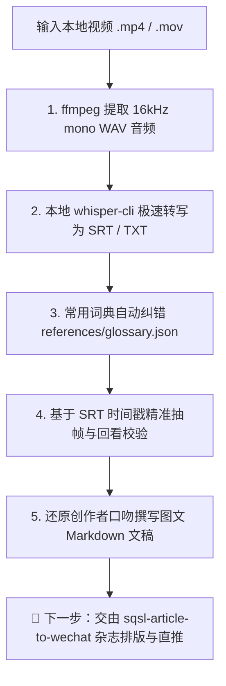

# 🎬 SQSL Video To Article (视频转图文文章生成引擎)

将本地视频素材快速转化为**图文并茂、高度对齐画面、完全保留创作者真实口吻与节奏**的高品质 Markdown 文章初稿。

> [!NOTE]
> 本技能专注于**「视频素材 ➔ 字幕纠错 ➔ 精准抽帧 ➔ 图文 Markdown 创作」**核心生产环节。
> 产生的 Markdown 文稿可直接交由家族排版引擎 [`sqsl-article-to-wechat`](../sqsl-article-to-wechat/SKILL.md) 渲染为微信公众号杂志风 HTML 并一键直推草稿箱。

---

## 核心流程（4 步闭环）



---

## 第一步：本地音频提取与极速转写

无需将庞大视频上传至云端模型，直接使用本地 `ffmpeg` + `whisper-cli`（搭载 Metal / GPU 硬件加速，几十秒内即可完成）：

### 自动化脚本一键运行
可以直接调用本技能内置的脚本：
```bash
python3 "<skill_dir>/scripts/video_to_article.py" "/path/to/video.mp4" [output_dir]
```
脚本会自动完成：
1. 提取 16kHz 单声道音频；
2. 调用本地 `whisper-cli` 生成带时间戳的 `.srt` 与全文 `.txt`；
3. 自动载入 `references/glossary.json` 进行同音字与专有名词纠错。

### 或手动分布执行：
```bash
# 1. 提取 16kHz 单声道音频
ffmpeg -y -i "input_video.mp4" -ar 16000 -ac 1 -c:a pcm_s16le /tmp/temp_audio.wav

# 2. 调用本地 whisper-cli
whisper-cli -m "$HOME/Library/Application Support/Screen Studio/models/ggml-small.bin" \
  -f /tmp/temp_audio.wav -l zh -osrt -otxt -of "/tmp/video_transcribe"
```

---

## 第二步：常用词典自动纠错（ASR Post-Processing）

语音识别（ASR）常出现同音字、专有名词与口播黑话错别字。必须结合 `references/glossary.json` 进行针对性修正：

### 核心纠错词表（持续维护）

| 常见识别错误 | 正确词汇 | 分类说明 |
| :--- | :--- | :--- |
| `三九十里` / `三酒十里` / `三舅十里` / `三教师李` | **三秋十李** | 创作者人名 |
| `老鸡家` / `老机家` / `老基家` | **老G家** | 创作者黑话 / 品牌 |
| `我可怕得` / `可怕得` / `可帕得` / `workbuddy` | **WorkBuddy** | 开发工具 / 平台 |
| `体速风格` / `替速风格` | **体素风格** | 设计 / 渲染术语 |
| `手渣` / `手扎` | **手札** | 文创 / 功能词 |
| `干液` / `盖业` | **盖印** | 交互功能 |
| `成婚和季节` | **晨昏和季节** | 场景描述 |
| `南平网中` / `骨盘中` | **南屏晚钟** / **古铜钟** | 景点 / 道具名 |
| `灵间的白露` / `精飞` | **林间的白鹭** / **惊飞** | 视觉动效 |
| `花港关于` / `锦礼` / `鱼石` | **花港观鱼** / **锦鲤** / **鱼食** | 景点 / 互动 |
| `断条的血` / `断条残雪` | **断桥的雪** / **断桥残雪** | 景点 / 意境 |
| `送机分` / `打签` | **送积分** / **打钱** | 真实口播梗 |
| `一码平穿` | **一马平川** | 成语表达 |
| `前灯` / `前登` | **前端** | 技术词汇 |
| `试图模型` | **视图模型** | 技术词汇 |

> 词库扩展与维护：直接编辑 `references/glossary.json`。

---

## 第三步：基于台词时间戳的精准抽帧与回看校验

**铁律：绝不在盲目估计的时间点截图，必须通过 SRT 字幕时间戳对齐，并使用 `view_file` 验证画面内容。**

1. **定位台词时间戳**：在生成的 `.srt` 字幕中找到讲述该功能/亮点的精准时点（例如 `01:21` 讲千问接手、`02:05` 展示体素地图）；
2. **提取清晰关键帧**：
   ```bash
   # 使用脚本抽帧
   python3 "<skill_dir>/scripts/video_to_article.py" --frame "input_video.mp4" 00:01:21 "assets/01_功能展示.jpg"
   
   # 或直接使用 ffmpeg 抽帧
   ffmpeg -y -ss 00:01:21 -i "input_video.mp4" -frames:v 1 -q:v 2 "assets/01_功能展示.jpg"
   ```
3. **视觉回看校验**：用 `view_file` 检查提取的图片，确认画面无黑屏、无转场模糊，且与台词内容 100% 呼应。

---

## 第四步：撰写 Markdown 文章（保持作者原汁原味）

1. **第一人称与口播节奏**：
   - 严禁改写为干瘪的公关稿或流水账汇报；
   - 保持视频中的生动口语与个人情绪（如“把我笑到了”、“简直是灾难现场”、“真不是广告，老G家看到请打钱”）；
   - 保留口播金句（如“AI 是绝对的加速器，也是绝对的放大器”）。
2. **克制精炼的三段式排版结构**：
   - 避免破碎的多级小标题，推荐精简三段式：
     - **Part 1：项目亮点与核心体验**
     - **Part 2：AI 协同、踩坑翻车与解决过程**
     - **Part 3：复盘思考与互动入口**
   - 句子自然分段（避免大段文字堆叠）；
   - 图片以 Markdown 相对路径 `` 紧随对应段落之后。

---

## 🎯 成果交付与后续流转

当本技能完成文章撰写后，输出：
1. **Markdown 文件**（如 `video_article.md`）；
2. **配套配图目录**（如 `assets/01_xxx.jpg`, `assets/02_xxx.jpg`）。

### 下一步推荐（衔接微信公众号排版）：
直接调用全家桶排版技能，一键将刚生成的 Markdown 转换为高水准排版并直推草稿箱：
```bash
/sqsl-article-to-wechat <生成的Markdown路径> --style editorial
```
或使用总路由简写：
```bash
/sqsl 帮我把刚生成的文章排版并推送到公众号
```
