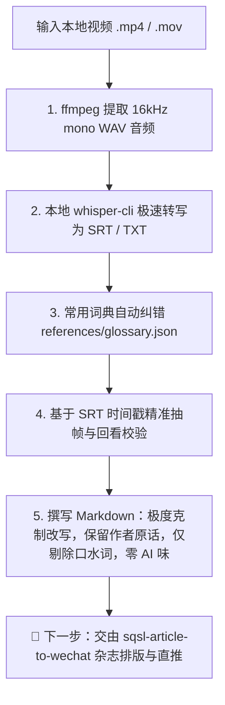

# 🎬 SQSL Video To Article (视频转图文文章生成引擎)

将本地视频素材快速转化为**图文并茂、高度对齐画面、克制润色、100% 保留作者原汁原味措辞与风格**的高品质 Markdown 文章初稿。

> [!NOTE]
> 本技能专注于**「视频素材 ➔ 字幕纠错 ➔ 精准抽帧 ➔ 克制原汁图文 Markdown」**核心生产环节。
> 产生的 Markdown 文稿可直接交由家族排版引擎 [`sqsl-article-to-wechat`](../sqsl-article-to-wechat/SKILL.md) 渲染为微信公众号杂志风 HTML 并一键直推草稿箱。

---

## 核心流程（4 步闭环）



---

## 第一步：本地音频提取与极速转写

无需将庞大视频上传至云端模型，直接使用本地 `ffmpeg` + `whisper-cli`（搭载 Metal / GPU 硬件加速，几十秒内即可完成）：

### 自动化脚本一键运行
可以直接调用本技能内置的脚本：
```bash
python3 "<skill_dir>/scripts/video_to_article.py" "/path/to/video.mp4" [output_dir]
```
脚本会自动完成：
1. 提取 16kHz 单声道音频；
2. 调用本地 `whisper-cli` 生成带时间戳的 `.srt` 与全文 `.txt`；
3. 自动载入 `references/glossary.json` 进行同音字与专有名词纠错。

### 或手动分布执行：
```bash
# 1. 提取 16kHz 单声道音频
ffmpeg -y -i "input_video.mp4" -ar 16000 -ac 1 -c:a pcm_s16le /tmp/temp_audio.wav

# 2. 调用本地 whisper-cli
whisper-cli -m "$HOME/Library/Application Support/Screen Studio/models/ggml-small.bin" \
  -f /tmp/temp_audio.wav -l zh -osrt -otxt -of "/tmp/video_transcribe"
```

---

## 第二步：常用词典自动纠错（ASR Post-Processing）

语音识别（ASR）常出现同音字、专有名词与口播黑话错别字。必须结合 `references/glossary.json` 进行针对性修正：

### 核心纠错词表（持续维护）

| 常见识别错误 | 正确词汇 | 分类说明 |
| :--- | :--- | :--- |
| `三九十里` / `三酒十里` / `三舅十里` / `三教师李` | **三秋十李** | 创作者人名 |
| `老鸡家` / `老机家` / `老基家` | **老G家** | 创作者黑话 / 品牌 |
| `我可怕得` / `可怕得` / `可帕得` / `workbuddy` | **WorkBuddy** | 开发工具 / 平台 |
| `体速风格` / `替速风格` | **体素风格** | 设计 / 渲染术语 |
| `手渣` / `手扎` | **手札** | 文创 / 功能词 |
| `干液` / `盖业` | **盖印** | 交互功能 |
| `成婚和季节` | **晨昏和季节** | 场景描述 |
| `南平网中` / `骨盘中` | **南屏晚钟** / **古铜钟** | 景点 / 道具名 |
| `灵间的白露` / `精飞` | **林间的白鹭** / **惊飞** | 视觉动效 |
| `花港关于` / `锦礼` / `鱼石` | **花港观鱼** / **锦鲤** / **鱼食** | 景点 / 互动 |
| `断条的血` / `断条残雪` | **断桥的雪** / **断桥残雪** | 景点 / 意境 |
| `送机分` / `打签` | **送积分** / **打钱** | 真实口播梗 |
| `一码平穿` | **一马平川** | 成语表达 |
| `前灯` / `前登` | **前端** | 技术词汇 |
| `试图模型` | **视图模型** | 技术词汇 |

> 词库扩展与维护：直接编辑 `references/glossary.json`。

---

## 第三步：基于台词时间戳的精准抽帧与回看校验

**铁律：绝不在盲目估计的时间点截图，必须通过 SRT 字幕时间戳对齐，并使用 `view_file` 验证画面内容。**

1. **定位台词时间戳**：在生成的 `.srt` 字幕中找到讲述该功能/亮点的精准时点（例如 `01:21` 讲千问接手、`02:05` 展示体素地图）；
2. **提取清晰关键帧**：
   ```bash
   # 使用脚本抽帧
   python3 "<skill_dir>/scripts/video_to_article.py" --frame "input_video.mp4" 00:01:21 "assets/01_功能展示.jpg"
   
   # 或直接使用 ffmpeg 抽帧
   ffmpeg -y -ss 00:01:21 -i "input_video.mp4" -frames:v 1 -q:v 2 "assets/01_功能展示.jpg"
   ```
3. **视觉回看校验**：用 `view_file` 检查提取的图片，确认画面无黑屏、无转场模糊，且与台词内容 100% 呼应。

---

## 第四步：撰写 Markdown 文章（克制修改 · 绝不改措辞 · 零 AI 味）

这是转图文最核心的纪律：**文稿是作者口播原话的书面化镜像，绝不是 AI 的二次扩写或八股重塑。**

### 1. 【核心红线】克制修改准则（Minimal Editing Rule）
- **绝不篡改作者原用词与句式**：
  - 作者用什么词，就保留什么词！绝不擅自换成更“正式”、“优美”、“高级”的书面语或成语。
  - 原话是大白话，就保留大白话；原话是口头吐槽、语气词（如“直接给我整不会了”、“真蚌埠住了”），必须一字不差地保留！
  - 严禁将作者的原话替换为公关腔、汇报体或新闻通讯体。
- **唯一允许的修改范围：精简口水词与停顿词**：
  - **允许删除**：纯口头无意义填充词（如“呃”、“啊”、“那个”、“然后然后”、“就是说”、“怎么说呢”、“对吧”、“其实就是其实”）、因说话磕巴造成的字词重复、录音停顿冗余。
  - **原则**：只修剪“结巴与口癖”，不触碰“表达与内容”。删掉口水词后句子顺畅即可，不要重新组装造句！

### 2. 【严打 AI 味】反 AI 腔调黑名单
在处理文本时，**严禁出现以下典型的“AI 假大空八股病”**：
- 🚫 **严禁八股式开篇与收尾**：
  - 严禁：“在当今...的时代”、“毫无疑问”、“综上所述”、“总的来说”、“值得一提的是”、“正如大家所知道的”；
  - 严禁私自“升华主题”或“上价值”（例如：“这不仅是一项技术的革新，更是对未来可能性的深邃探索……”——作者没说这种大话，AI 绝不可编造）。
- 🚫 **严禁词汇升级与互联网黑话**：
  - 不要把作者的“做个网页”篡改成“赋能网页应用”；
  - 不要把作者的“找了个方法”篡改成“构建了全新的底层范式”；
  - 不要用“令人叹为观止”、“宛如...”、“底色”、“抓手”、“闭环”、“矩阵”等过度修饰词。
- 🚫 **严禁机械对仗与虚假结构**：
  - 严禁把作者连贯真实的讲话强行拆解成生硬的“第一、第二、第三”或“首先、其次、最后”；
  - 严禁给每个自然段都机械化地冠上四个字对仗的小标题。小标题应精简自然，直接提取作者讲述的核心事件或原话。

### 3. 【对比示范】改写边界示例

| 场景 | 原始转写文本 | ❌ 错误做法（AI味重 / 篡改措辞） | ✅ 正确做法（克制修改 / 仅去口水词） |
| :--- | :--- | :--- | :--- |
| **突发翻车** | “然后……呃，我当时就直接懵了，老G家这个接口居然直接报了个500，给我整不会了。” | “随后笔者陷入了困惑，该服务接口异常返回了500状态码，令人颇感无奈与棘手。” *(改成了做作的书面语，丧失了作者个性)* | “我当时直接懵了，老G家这个接口居然直接报了个500，给我整不会了。” *(仅去掉了“然后……呃”，100%保留作者语气与原词)* |
| **开篇引入** | “今天呢，就是想跟大家聊聊我这几天折腾的一个小玩意，其实就是用AI帮我写代码。” | “在当今数字化浪潮下，AI编程已成为提升生产力的关键抓手。本文将分享作者近期在智能研发领域的实践心得。” *(经典AI八股，爹味与说教感十足)* | “今天想跟大家聊聊我这几天折腾的一个小玩意，用AI帮我写代码。” *(删掉“呢”、“就是”、“其实就是”，保持作者自然亲切的聊天感)* |
| **技术思考** | “就怎么说呢，AI它确实是个加速器，但如果你自己逻辑不清楚，它也是个放大器，把你坑更大。” | “毋庸置疑，人工智能既是效能倍增的加速器，亦是风险放大的双刃剑，唯有夯实底层逻辑方能行稳致远。” *(过度成语化、强行升华)* | “AI确实是个加速器，但如果你自己逻辑不清楚，它也是个放大器，把你坑更大。” *(仅去除“就怎么说呢”，保留最真实接地气的表达)* |

### 4. 真实自然的三段式排版结构
- 保持呼吸感：自然分段，段落之间留白，避免一大坨字堆在一起；
- 建议遵循自然的讲故事三段式：
  - **Part 1：项目亮点与核心体验**（作者做了什么、效果有多爽）
  - **Part 2：AI 协同、踩坑翻车与解决过程**（遇到什么具体的坑、怎么排查调优）
  - **Part 3：复盘思考与互动**（真实的经验总结、作者留给读者的互动话语）
- 图片紧随对应台词段落：``，图文精准对应。

---

## 🎯 成果交付与后续流转

当本技能完成文章撰写后，输出：
1. **Markdown 文件**（如 `video_article.md`）；
2. **配套配图目录**（如 `assets/01_xxx.jpg`, `assets/02_xxx.jpg`）。

### 下一步推荐（衔接微信公众号排版）：
直接调用全家桶排版技能，一键将刚生成的 Markdown 转换为高水准排版并直推草稿箱：
```bash
/sqsl-article-to-wechat <生成的Markdown路径> --style editorial
```
或使用总路由简写：
```bash
/sqsl 帮我把刚生成的文章排版并推送到公众号
```
